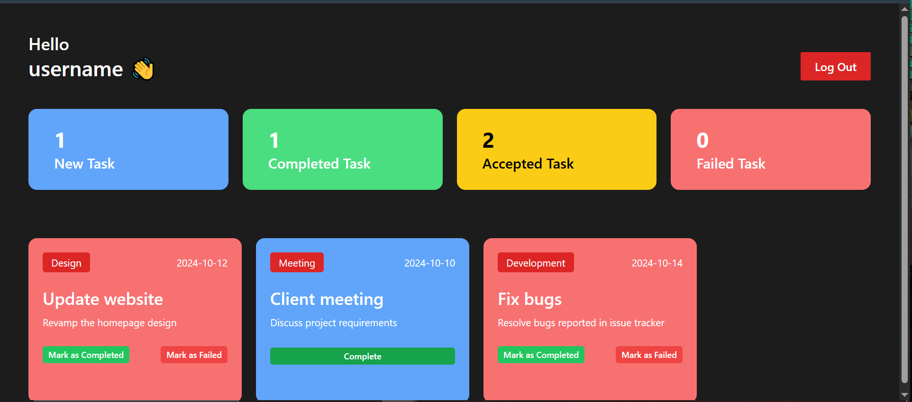
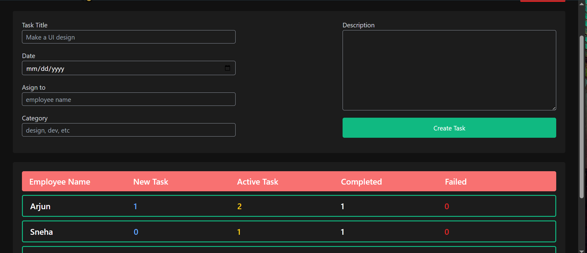

# Employee Management System

A full-featured Employee Management System built with **React.js**. This application allows admins to manage employees and assign them tasks with an easy-to-use interface.

## 🚀 Features

- 👤 Add, edit, and delete employee records
- ✅ View a list of all employees
- 📋 Assign tasks to employees
- 🔄 Track and update task status
- 📈 Organized and searchable employee list
- 🖥️ Responsive and modern UI
- ⚛️ Built using React functional components and hooks

## 📸 Screenshots

### Login Page

### Employee Dashboard

### Admin Dashboard

## 🛠️ Technologies Used

- **React.js** (Create React App)
- **HTML5** & **CSS3**
- **JavaScript (ES6+)**
- **Bootstrap**
- Local Storage

